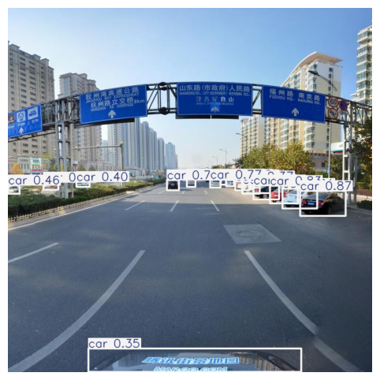

# 🚦 Fine-Tuning YOLOv8m for Traffic Sign Detection on the TT100K-4 Dataset

This repository contains the implementation and results of fine-tuning the YOLOv8m model for traffic sign detection using the TT100K-4 dataset. The study focuses on optimizing the model for small object detection under real-world conditions such as occlusion, variable lighting, and diverse sign types.

---

## 📝 Abstract

This work explores the impact of fine-tuning YOLOv8m on traffic sign detection performance by evaluating different learning rates and batch sizes. Initially, the model showed limited performance, but after fine-tuning with optimal hyperparameters (`batch_size=24`, `lr=0.001`), it achieved significant improvements:

- **Precision**: 81.87%  
- **Recall**: 56.24%  
- **mAP@50**: 70.09%  
- **mAP@50-95**: 55.89%

---

## 📁 Dataset

We used a refined subset of the TT100K dataset — **TT100K-4** — which includes the following categories:

- Speed Limit Signs
- Prohibitory Signs (e.g., No Entry)
- Mandatory Signs (e.g., Turn Right)
- Warning Signs (e.g., Pedestrian Crossing)

> The TT100K-4 subset improves class balance and simplifies the detection task while maintaining high-resolution imagery and real-world complexity.

---

## 🏗️ Model Architecture

We fine-tuned the **YOLOv8m** (medium variant) model from Ultralytics, which features:

- **Backbone**: CSPDarknet with ELAN
- **Neck**: BiFPN (Bi-directional Feature Pyramid Network)
- **Head**: Decoupled for classification and regression (anchor-free)

YOLOv8m was chosen due to its strong performance in small object detection and real-time inference (~130 FPS).

---

## ⚙️ Fine-Tuning Details

| Batch Size | Learning Rate | Precision | Recall | mAP@50 | mAP@50-95 | Fitness Score |
|------------|----------------|-----------|--------|--------|------------|----------------|
| -          | -              | 59.49%    | 18.07% | 17.10% | 12.53%     | 12.99%         |
| 16         | 0.1            | 58.57%    | 47.12% | 50.69% | 40.10%     | 41.16%         |
| 24         | 0.001          | **81.87%**| **56.24%** | **70.09%** | **55.89%** | **57.31%**     |

> Lower learning rate and larger batch size resulted in the most stable training and generalization.

---

## 📊 Results

Fine-tuning substantially improved all detection metrics and reduced false positives. The model was better able to recognize and localize traffic signs of various sizes and complexities.

### 🔍 Qualitative Results

Bounding boxes before and after fine-tuning show a dramatic improvement in prediction confidence and label accuracy. For instance, a low-confidence “clock” prediction was corrected to a traffic sign with 0.83 confidence post fine-tuning.

---

## 📌 Key Takeaways

- Fine-tuning on task-specific data is crucial for performance.
- Hyperparameter tuning (especially learning rate and batch size) has a significant impact on object detection accuracy.
- YOLOv8m offers a balanced trade-off between speed and accuracy for real-time applications.

---

## 🚀 Future Work

- Data augmentation techniques
- Domain adaptation for multi-country sign sets
- Comparison with YOLOv9 and transformer-based models

---
## 🖼️ Example Predictions

Below are visual comparisons of predictions made by the YOLOv8m model **before** and **after** fine-tuning on the TT100K-4 dataset.

### 🔍 Example 1

| Before Fine-Tuning | After Fine-Tuning |
|--------------------|-------------------|
|  |  |

- **Before**: Model misclassified the sign with a confidence score of 0.27.
- **After**: Correctly identified the traffic sign with a confidence score of 0.83.

---

### 🔍 Example 2

| Before Fine-Tuning | After Fine-Tuning |
|--------------------|-------------------|
|  |  |

- **Before**: Missed detection due to low contrast and small size.
- **After**: Successfully detected and classified the sign with high precision.

---
